# HealthFlow AI Architecture

This document contains a MermaidJS flowchart that illustrates the AI architecture and data flows for the various intelligent features within the HealthFlow application.

```mermaid
graph TD
    subgraph "User & System Inputs"
        UI1["Patient describes symptoms (text)"]
        UI2["Patient uploads lab report (image)"]
        UI3["User enters multiple medication names (text)"]
        UI4["Patient uploads medical scan (X-ray, etc.)"]
        UI5["Patient provides health profile & wearable data (JSON)"]
        UI6["Doctor provides consultation transcript (text)"]
        UI7["Doctor provides patient clinical data (text)"]
        UI8["User asks chatbot a question (text)"]
        UI9["Patient sends an inquiry message (text)"]
        UI10["Doctor provides scheduling constraints (JSON)"]
    end

    subgraph "AI Processing Engine (Genkit & Gemini)"
        A["Genkit AI Engine with Google Gemini Model"]
    end

    subgraph "Structured AI Outputs"
        O1["Potential Conditions & Seriousness (JSON)"]
        O2["Detailed Lab Metric Analysis & Summary (JSON)"]
        O3["Interaction Severity & Description (JSON)"]
        O4["Potential Conditions, Observations & Heatmap (JSON)"]
        O5["Personalized Fitness & Wellness Plan (JSON)"]
        O6["Formatted SOAP Notes (JSON)"]
        O7["Readmission & Complication Risk Scores (JSON)"]
        O8["Natural Language Answer (JSON)"]
        O9["Triage Department, Urgency & Summary (JSON)"]
        O10["Optimal Appointment Slot & Reasoning (JSON)"]
    end

    subgraph "Application Features (Patient)"
        F1[Symptom Analyzer]
        F2[Lab Report Interpreter]
        F3[Medication Checker]
        F4[Imaging Diagnosis]
        F5[Fitness Coach]
        F8[General AI Chatbot]
        F9[Inquiry Assistant]
    end

    subgraph "Application Features (Employee)"
        F6[Medical Notes Generator]
        F7[Predictive Risk Model]
        F10[Schedule Assistant]
    end

    %% Patient Flows
    UI1 -- "analyzeSymptoms" --> A --> O1 --> F1
    UI2 -- "analyzeLabReport" --> A --> O2 --> F2
    UI3 -- "checkMedicationInteractions" --> A --> O3 --> F3
    UI4 -- "diagnoseImage" --> A --> O4 --> F4
    UI5 -- "getFitnessPlan" --> A --> O5 --> F5
    UI8 -- "aiChatbotAssistant" --> A --> O8 --> F8
    UI9 -- "inquiryTriage" --> A --> O9 --> F9

    %% Employee Flows
    UI6 -- "generateMedicalNotes" --> A --> O6 --> F6
    UI7 -- "predictiveRiskModel" --> A --> O7 --> F7
    UI10 -- "scheduleAppointment" --> A --> O10 --> F10
```

