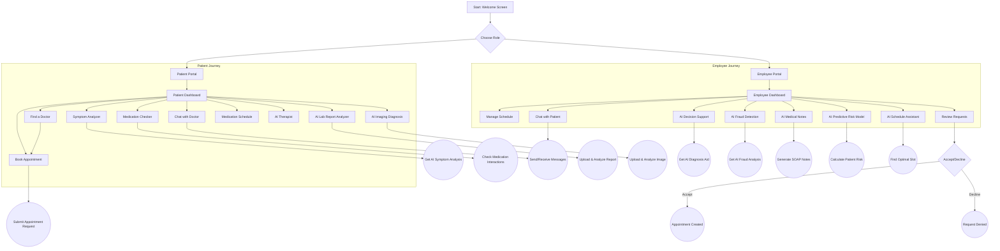

# HealthFlow Application User Flow

This document contains a MermaidJS flowchart that illustrates the user journey for both the Patient and Employee roles within the HealthFlow application.

```mermaid
graph TD
    A[Start: Welcome Screen] --> B{Choose Role};

    B --> C[Patient Portal];
    B --> D[Employee Portal];

    subgraph Patient Journey
        C --> E[Patient Dashboard];
        E --> F1[Book Appointment];
        E --> F2[Find a Doctor];
        E --> F3[Symptom Analyzer];
        E --> F4[Medication Checker];
        E --> F5[Chat with Doctor];
        E --> F6[AI Lab Report Analyzer];
        E --> F7[Medication Schedule];
        E --> F8[AI Therapist];
        E --> F9[AI Imaging Diagnosis];
    end

    subgraph Employee Journey
        D --> G[Employee Dashboard];
        G --> H1[Manage Schedule];
        G --> H2[Review Requests];
        G --> H3[Chat with Patient];
        G --> H4[AI Decision Support];
        G --> H5[AI Fraud Detection];
        G --> H6[AI Medical Notes];
        G --> H7[AI Predictive Risk Model];
        G --> H8[AI Schedule Assistant];
    end

    F1 --> I1((Submit Appointment Request));
    F2 --> F1;
    F3 --> I2((Get AI Symptom Analysis));
    F4 --> I3((Check Medication Interactions));
    F5 --> I4((Send/Receive Messages));
    F6 --> I5((Upload & Analyze Report));
    F9 --> I6((Upload & Analyze Image));

    H2 --> J1{Accept/Decline};
    J1 -- Accept --> J2((Appointment Created));
    J1 -- Decline --> J3((Request Denied));
    H3 --> I4;
    H4 --> J4((Get AI Diagnosis Aid));
    H5 --> J5((Get AI Fraud Analysis));
    H6 --> J6((Generate SOAP Notes));
    H7 --> J7((Calculate Patient Risk));
    H8 --> J8((Find Optimal Slot));

```
